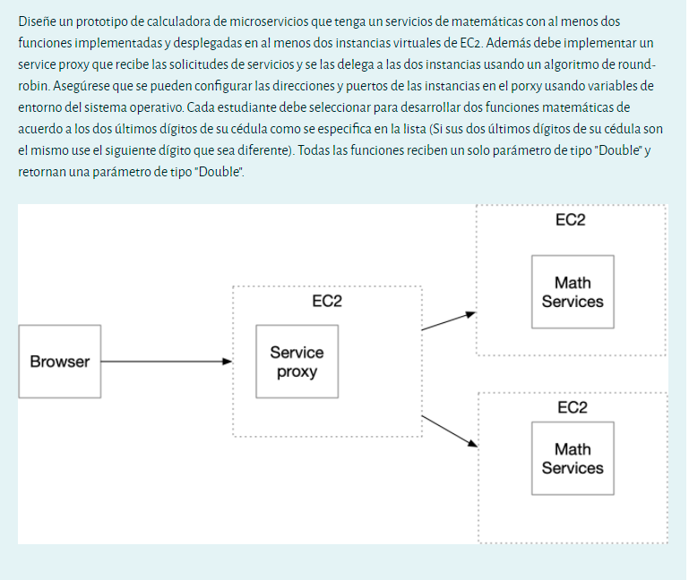
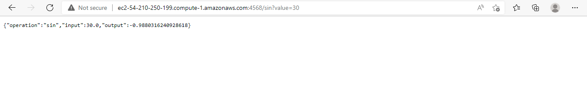
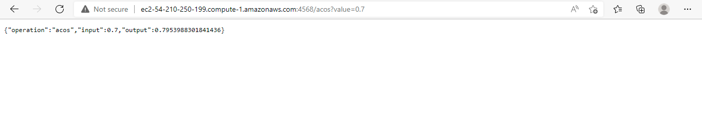
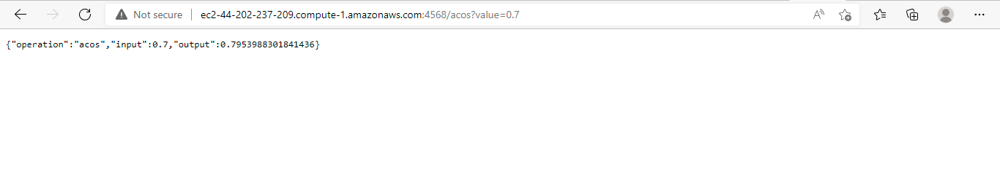
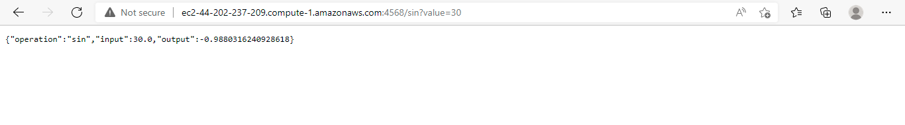
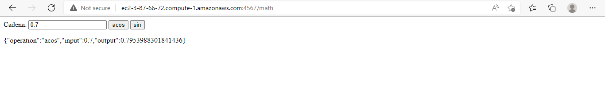

# AREP-PARCIAL2T

Es un protoripo de calculadora de microservicios que tiene un servicio de matematicas el cual cuenta con dos funciones, acos y sin, se encuentran implementadas y desplegadas dentro de dos instancias virtuales de EC2. Ademas implementa un servicio de proxy que recibe las solicitudes de servicios y se las desplega a las dos instancias usando un algoritmo de round robin. Tiene la configuracion de las dirrecciones y puertos usando variables de entorno.


## Math Service 1




como podemos ver en las siguientes imagenes se puede apreciar que la direccion de donde se ecnuentra subida es, en este caso el puerto es 4568
``` 
ec2-54-210-250-199.compute-1.amazonaws.com
```

como se decia anteriormente este cuenta con dos funcione de matematicas, en este caso es sin y acos

## Math Service 2




como podemos ver en las siguientes imagenes se puede apreciar que la direccion de donde se ecnuentra subida es, en este caso el puerto es 4568
``` 
ec2-44-202-237-209.compute-1.amazonaws.com
```

como se decia anteriormente este cuenta con dos funcione de matematicas, en este caso es sin y acos

## Service proxy
En este caso el que esta consumiendo los servicios que la url de este es, y el puerto que esta usando es 4567
``` 
http://ec2-3-87-66-72.compute-1.amazonaws.com:4567/math
```


##Como correrlo en EC2

Para poder asegurarnos que el proyecto este corriendo de forma correcta debemos primero compilar , en este caso se deben compilar dos el proxy y el serviceMath, esto se realiza con el comando
``` 
mvn clean install
```
despues de haber compilado y asegurarse que todo ejecuto de forma correcta ingresamos a AWS y empezamos a ejecutar los EC2 que se van a usar, una ves que ya los tengan, debe tener en cuenta para que va a usar cada uno de estos en este caso deben buscar el el proxy la clase HttpServicePDT, y en esta buscar las lineas que dicen 
``` 
    private static String url = "ec2-3-87-66-72.compute-1.amazonaws.com";
    private static Integer ports = 4567;

    public static void main(String[] args) throws IOException {
        listicaURL[0] = "ec2-54-210-250-199.compute-1.amazonaws.com:4568";
        listicaURL[1] = "ec2-44-202-237-209.compute-1.amazonaws.com:4568";
```
la primer url es donde se ubuicara el proxy, y la variable ports es el puerto de esta, las dos siguientes urls van a ser para los servicios, en este caso hay mismo ubica el puerto que desea manejar. 

Luego de que ya alla realizado estos cambios, debe volver a ejecutar el comando
``` 
mvn clean install
```

Una vez realizado debe subir la carpeta proxy a la maquina asignada para EC2, y la carpeta serviceMath a las dos maquinas, una vez en este debe ejecutar los tres servicios.
